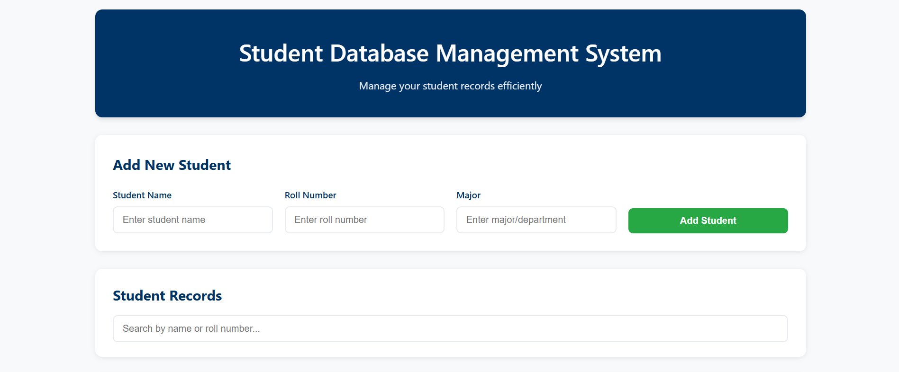
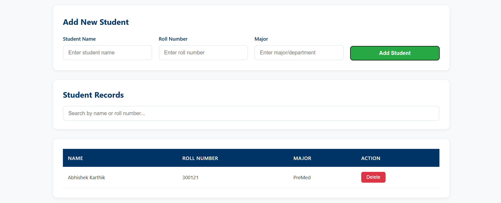
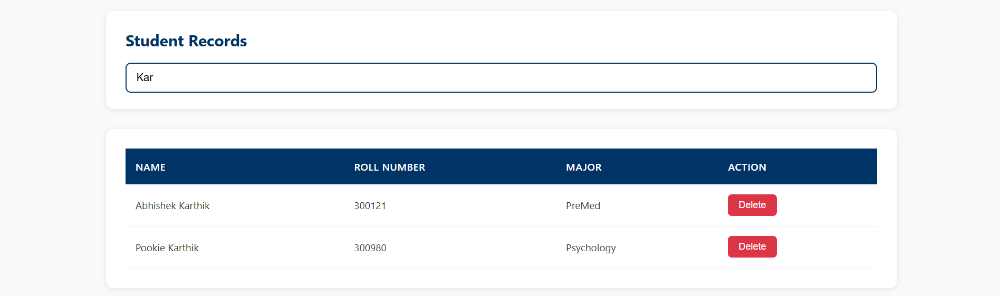

# Student Database – Array-Based Management System

**Student Database** is a simple, array-based management system built using HTML, CSS, and JavaScript. It allows users to store student details in arrays, perform searches by name or roll number, and manage add/delete operations with a clean, modern UI.

## Features

- **Add Students**
  - Enter student name, roll number, and major to add new records.
  - Records are automatically displayed in the main student table.

- **Search Functionality**
  - Search students by name or roll number.
  - The table dynamically filters to display only matching results.

- **Delete Records**
  - Remove individual students with a single click.
  - Keeps the student data organized and up-to-date.

- **Responsive UI**
  - Modern school-themed design with a professional blue and white color scheme.
  - Works on both desktop and mobile screens.

## Tech Stack

- **Frontend:** HTML5, CSS3
- **Logic & Functionality:** Vanilla JavaScript (Array-based storage)
- **No Backend Required:** All data is stored in arrays in the browser and resets on page refresh.

## Getting Started

1. **Clone the repository:**
   ```bash
   git clone [https://github.com/your-username/StudentDatabase.git](https://github.com/your-username/StudentDatabase.git)
   cd StudentDatabase
- Run the project:
- Simply open the student.html file in any web browser.
- No server or additional setup is required.

## Project Structure
```bash

StudentDatabase/
├── student.html      # Contains all HTML, CSS, and JavaScript for the app
└── README.md         # Project documentation
```
## Screenshots
1. Home Page – student records and the grid


2. Adding a Patient – Entering student details in the Add/Update form


3. Search Functionality – Searching student by name


## Future Improvements
- Persistent storage using localStorage to save data between sessions.
- An "Edit" button to update existing student records.
- Additional fields like GPA, contact information, and enrollment date.
- Option to export student data as a CSV or JSON file.

##
## Coded by Mahi Shukla, Abhishek Karthik